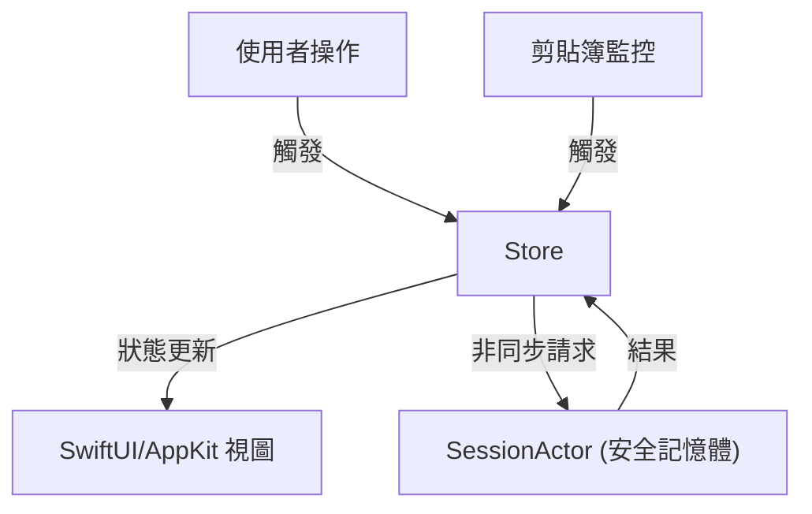

# CodeMask

**繁體中文** | [English](README_EN.md)

> **專為開發工作流設計的原生 macOS 機密資料防護工具。**  
> 採用 Swift 6.2 (Strict Concurrency)、零依賴架構與自定義單向資料流 (Unidirectional Data Flow) 打造。


[](https://opensource.org/licenses/MIT)

---

## 📖 專案概述

**CodeMask** 解決了開發者工作流中一個關鍵的安全漏洞：意外將機密資訊（API Key、個資 PII、憑證）暴露於剪貼簿中。

不同於一般的剪貼簿管理工具，CodeMask 是一個**安全優先 (Security-First)** 的解決方案。它利用高效能 Regex 自動識別敏感模式，將其替換為安全 Token，並將原始數據存儲於**鎖定的記憶體 (`mlock`)** 中。這確保了敏感數據永遠不會接觸硬碟（Swap 空間），僅在明確請求時才進行還原。

本專案展示了進階 macOS 開發能力，包括底層記憶體管理、嚴格的併發安全 (Strict Concurrency)，以及不依賴第三方庫的可擴展架構。

## ✨ 核心功能

-   **零硬碟殘留 (Zero Disk Residue):** 敏感數據僅存在於 RAM 中。我們使用 `mlock` 防止數據被交換至硬碟，並在超時後自動清除。
-   **原生極致效能:** 使用 **Swift 6.2** 開發，啟用 **Strict Concurrency** 模式以確保執行緒安全。
-   **單向資料流架構:** 自建類 Redux 狀態管理系統，確保 Menu Bar、HUD 與背景監控程式之間的狀態一致性。
-   **守護者模式 (Guardian Mode):** 輕量級背景監控，使用 Conflated Tasks 高效輪詢剪貼簿變更，避免 CPU 資源浪費。
-   **開發者友善:** 針對速度優化 (<100ms 延遲)，支援全域快捷鍵 (Global Hotkeys) 的鍵盤優先操作。

## 🛠 技術棧 (Tech Stack)

-   **語言:** Swift 5.9+ (啟用 Swift 6.2 Strict Concurrency 模式)
-   **UI 框架:** 
    -   **SwiftUI:** 用於現代化、聲明式 UI (設定頁面、HUD)。
    -   **AppKit:** 處理系統層級視窗管理 (`NSPanel`)、選單列整合 (`NSStatusBar`) 與全域快捷鍵。
-   **架構:** 自定義單向資料流 (State, Actions, Reducers, Store)。
-   **併發處理:** Swift Actors (`SessionActor`)、`async/await` 與任務優先級管理。
-   **安全性:** 使用 `UnsafeMutableRawPointer` 進行直接記憶體管理 (`mlock`/`munlock`)。
-   **測試:** XCTest 搭配 Protocol-Oriented Mocking (完全不依賴外部 Mock 庫)。

## 🏗️ 架構設計

CodeMask 嚴格遵循單向資料流原則，避免了 "Massive View Controller" 問題與競態條件 (Race Conditions)。



### 架構亮點:
*   **單一事實來源 (Single Source of Truth):** `AppStore` 持有完整的應用程式狀態。
*   **執行緒安全 (Thread Safety):** 敏感 Session 數據隔離在 `SessionActor` 內，即使在高頻剪貼簿事件下也能保證存取安全。
*   **功能優先組織 (Feature-First):** 程式碼庫依據領域 (Clipboard, Session, Profiles, Guardian) 模組化，而非分層結構，使其更具可擴展性且易於導航。

## 📂 專案結構

```bash
CodeMask/
├── App/            # 程式入口與依賴注入 (Dependency Injection)
├── Core/           # 共用工具與安全 (mlock) 邏輯
├── Features/       # 功能模組 (State, Actions, Views)
│   ├── Clipboard/  # Regex 引擎與監控邏輯
│   ├── Guardian/   # 背景分析 Context
│   ├── Session/    # 安全 Actor 與 Token 管理
│   └── UI/         # HUD 與選單列控制器
└── Resources/      # 資源與預設配置
```

## 🚀 快速開始

### 前置需求
-   macOS 14.5 (Sonoma) 或更高版本
-   Xcode 15+

### 建置與執行
1.  Clone 此儲存庫。
2.  使用 Xcode 開啟 `CodeMask/CodeMask.xcodeproj`。
3.  確保 Scheme 設定為 **CodeMask**。
4.  建置並執行 (`Cmd + R`)。

### 執行測試
本專案包含完整的單元測試套件，使用 XCTest 與 Mock 策略。
```bash
# 透過指令行執行測試
xcodebuild -project CodeMask/CodeMask.xcodeproj -scheme CodeMask test
```

## 🗺️ 專案路線圖 (Roadmap)

目前的專案已完成核心安全引擎與基礎 UI，未來的開發計劃如下：

- [ ] **視覺化演示更新**: 錄製並上傳高品質 GIF，展示自動遮罩、HUD 提示與安全還原的實際操作流。
- [ ] **多專案配置管理 (Profiles)**: 支援針對不同客戶或專案設定不同的 Regex 規則集。
- [ ] **本地安全審計日誌**: 提供已觸發規則的歷史記錄（不含敏感數據內容）。
- [ ] **進階瀏覽器守護**: 當剪貼簿含有未遮罩敏感資訊且使用者切換至瀏覽器時，主動發出 HUD 警告。

## 📜 授權條款

本專案採用 MIT 授權條款。

---
*由 [hozzz9487](https://github.com/hozzz9487) 開發。專為高安全性、極致效能的 macOS 環境打造。*