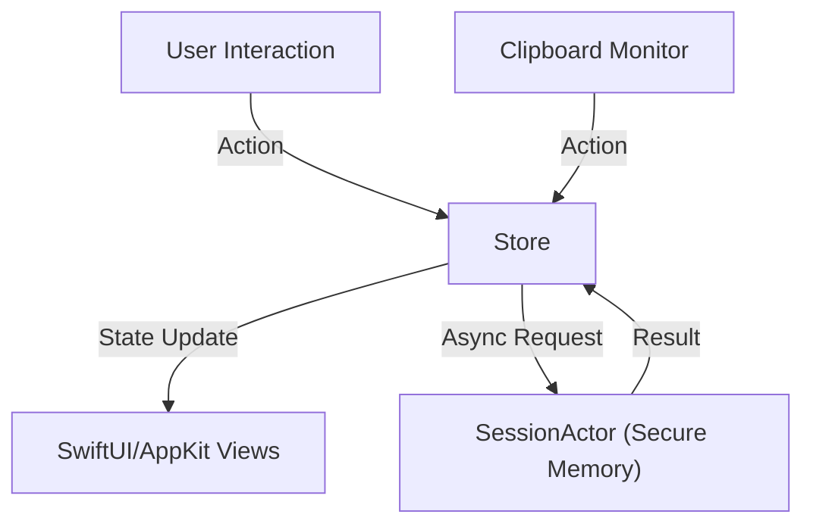

# CodeMask 🛡️

[繁體中文](README.md) | **English**

> **A native macOS utility for securing sensitive data during development workflows.**  
> Built with Swift 6.2 (Strict Concurrency), Zero Dependencies, and a custom Unidirectional Data Flow architecture.


[](https://opensource.org/licenses/MIT)

---

## 📖 Overview

**CodeMask** addresses a critical security gap in developer workflows: the accidental exposure of secrets (API keys, PII, credentials) in the clipboard. 

Unlike generic clipboard managers, CodeMask is a **security-first** tool. It automatically identifies sensitive patterns using high-performance Regex, replaces them with secure tokens, and stores the original data in **locked memory (`mlock`)**. This ensures that sensitive data never touches the disk (swap space) and is only restored when explicitly requested.

This project demonstrates advanced macOS development capabilities, including low-level memory management, strict concurrency safety, and a scalable architecture built without third-party libraries.

## ✨ Key Features

-   **Zero Disk Residue:** Sensitive data is stored in RAM only. We use `mlock` to prevent data from being swapped to disk, and auto-purge it after a timeout.
-   **Native Performance:** Written in **Swift 6.2** with **Strict Concurrency** enabled.
-   **Unidirectional Data Flow:** A custom-built, Redux-like state management system ensuring thread safety across the Menu Bar, HUD, and background monitors.
-   **"Guardian Mode":** A lightweight background monitor that polls clipboard changes efficiently using conflated tasks to prevent CPU spikes.
-   **Developer-Centric:** Optimized for speed (<100ms latency) and keyboard-first workflows via Global Hotkeys.

## 🛠 Tech Stack

-   **Language:** Swift 5.9+ (Swift 6.2 Strict Concurrency mode)
-   **UI Frameworks:** 
    -   **SwiftUI:** For modern, declarative UI (Settings, HUD).
    -   **AppKit:** For system-level window management (`NSPanel`), Menu Bar integration (`NSStatusBar`), and Global Hotkeys.
-   **Architecture:** Custom Unidirectional Flow (State, Actions, Reducers, Store).
-   **Concurrency:** Swift Actors (`SessionActor`), `async/await`, and `Task` prioritization.
-   **Security:** `UnsafeMutableRawPointer` for direct memory management (`mlock`/`munlock`).
-   **Testing:** XCTest with Protocol-Oriented Mocking (Zero external mocking libraries).

## 🏗️ Architecture

CodeMask avoids "Massive View Controllers" and race conditions by strictly adhering to a unidirectional data flow.



### Highlights:
*   **Single Source of Truth:** The `AppStore` holds the entire application state.
*   **Thread Safety:** Sensitive session data is isolated within the `SessionActor`, guaranteeing safe access even when high-frequency clipboard events occur.
*   **Feature-First Organization:** The codebase is modularized by domain (Clipboard, Session, Profiles, Guardian) rather than layer, making it scalable and easy to navigate.

## 📂 Project Structure

```bash
CodeMask/
├── App/            # Entry point & Dependency Injection
├── Core/           # Shared Utilities & Security (mlock) logic
├── Features/       # Feature modules (State, Actions, Views)
│   ├── Clipboard/  # Regex Engine & Monitoring
│   ├── Guardian/   # Background Analysis Context
│   ├── Session/    # Secure Actor & Token Management
│   └── UI/         # HUD & Menu Bar Controllers
└── Resources/      # Assets & Presets
```

## 🚀 Getting Started

### Prerequisites
-   macOS 14.5 (Sonoma) or later
-   Xcode 15+

### Build & Run
1.  Clone the repository.
2.  Open `CodeMask/CodeMask.xcodeproj` in Xcode.
3.  Ensure the scheme is set to **CodeMask**.
4.  Build and Run (`Cmd + R`).

### Running Tests
The project includes a comprehensive suite of unit tests using XCTest and mock strategies.
```bash
# Run tests via command line
xcodebuild -project CodeMask/CodeMask.xcodeproj -scheme CodeMask test
```

## 📜 License

This project is licensed under the MIT License.

---
*Created by [hozzz9487](https://github.com/hozzz9487). Targeted for high-security, performance-critical macOS environments.*
