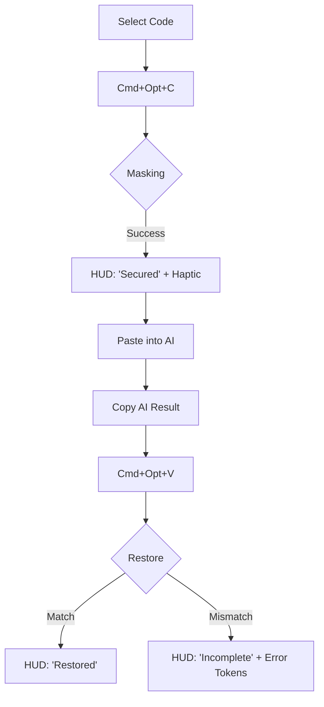
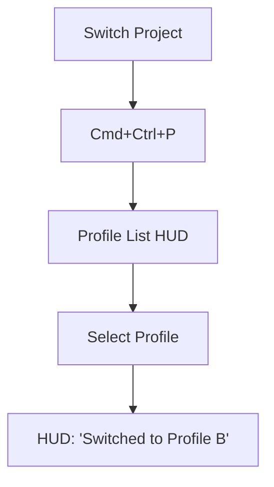
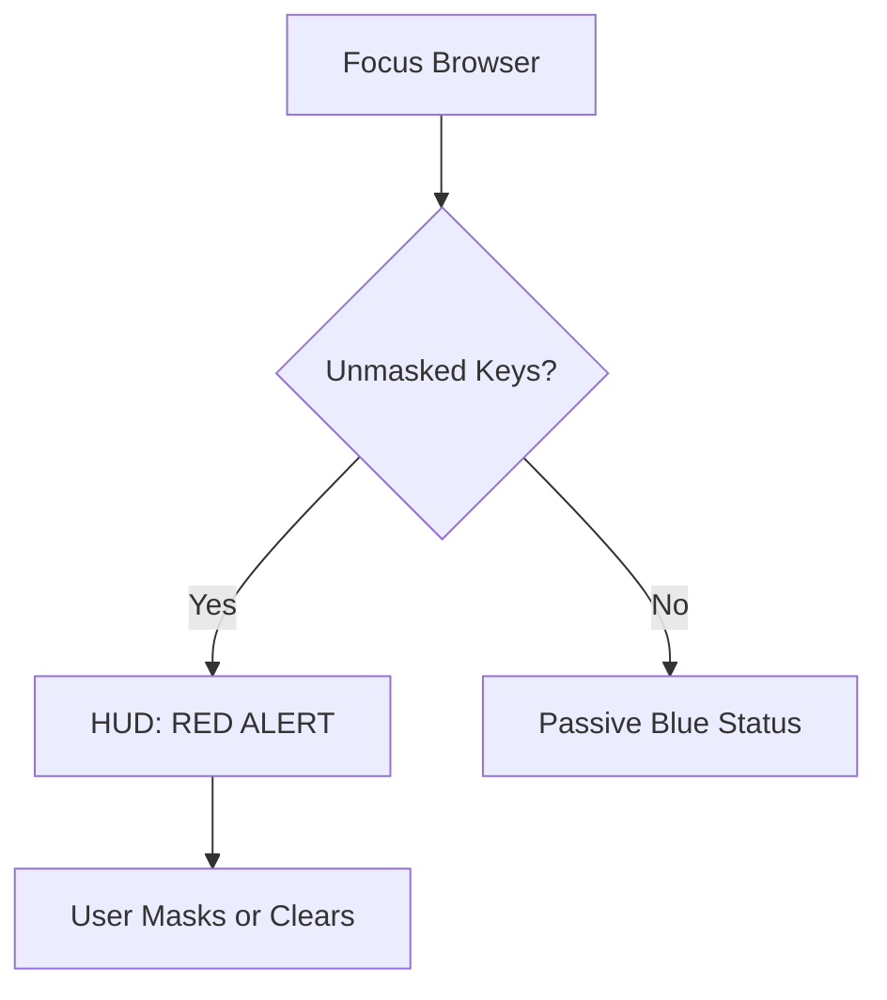

# UX Design Specification CodeMask

**Author:** Edison
**Date:** 2025-12-19

---

## Executive Summary

### Project Vision

CodeMask is a native macOS "Security Layer" for the AI-assisted developer. It aims to eliminate the friction between security compliance and development velocity by providing a bidirectional, zero-latency masking engine. The vision is to make data protection an invisible, automated part of the clipboard workflow, allowing developers to leverage the world's most powerful AI models without ever compromising their project's most sensitive secrets.

### Target Users

*   **The Sprinter (Efficiency-First):** Demands zero-latency and invisible workflows. Success is defined by staying in "the flow" while protected.
*   **The Juggler (Multi-Project):** Needs high-confidence isolation between client contexts. Success is defined by zero cross-project data leakage.
*   **The Guardian (Security-Conscious):** Requires visible proof of protection (HUD/Logs) and fail-safe protocols. Success is defined by the reduction of "security anxiety."
*   **The Rule Maker (Lead/Architect):** Needs to standardize security across teams. Success is defined by the ease of rule creation and distribution.

### Key Design Challenges

*   **Focus Preservation:** Ensuring visual feedback (HUDs) provides status without stealing keyboard focus or interrupting the typing flow.
*   **Fail-Safe Visualization:** Designing clear, non-alarming recovery flows for restoration mismatches, rather than just error messages.
*   **Regex Approachability:** Abstracting complex regex logic into a user-friendly interface for rule creation.
*   **The "Black Box" Problem:** Visualizing invisible security actions (like memory purging) to build user trust in the "Zero-Persistence" promise.

### Design Opportunities

*   **Just-in-Time (JIT) Context:** Allowing users to switch project profiles on-the-fly (e.g., during the paste action) to prevent workflow breakage.
*   **Optimistic Feedback:** Implementing immediate visual confirmation for masking actions to create a perception of "zero latency," even during processing.
*   **Ambient Status Pattern:** Using peripheral feedback (Menu Bar icons, subtle sounds) rather than modal alerts to maintain the "flow state."
*   **Native UI as Trust Signal:** Adhering strictly to macOS Human Interface Guidelines (HIG) to reinforce the credibility of the "Local-Only" architecture.

## Core User Experience

### Defining Experience

The core experience of CodeMask is the "Secure Copy-Paste Loop." It transforms the system clipboard into a smart, bidirectional translation layer. The goal is to make data protection feel like a native, invisible extension of the developer's workflow, where "Masking" is effortless and "Restoration" is magic.

### Platform Strategy

CodeMask is a native macOS application built with Swift for sub-100ms latency. The application is strictly offline-first, with all session data stored in local memory (RAM) and protected via memory locking (`mlock`). The MVP features a simplified "Health Monitor" Menu Bar icon with two primary states: **Safe** (Blue) and **Warning/Danger** (Red, triggered by browser focus or unmasked secrets).

### Effortless Interactions

*   **Invisible Masking:** Background regex processing with optimistic HUD feedback ("Secured") to preserve flow state.
*   **Sensory Confirmation:** Subtle audio and haptic feedback (trackpad tap) to confirm successful masking without requiring a visual check.
*   **Explicit Error Tokens:** If restoration fails (mismatch or expired session), the system pastes the code with `>>MISSING_SECRET<<` markers. This breaks the build safely while allowing the user to find and fix errors instantly using the IDE's native search (`Cmd+F`).

### Critical Success Moments

*   **The First "Magic" Restore:** Successfully re-hydrating multiple project variables into AI-generated code with zero manual editing.
*   **Security Lifecycle Awareness:** Receiving a clear "Session Expired" HUD alert after a period of inactivity, transforming a potential "bug" into a valued security feature.

### Experience Principles

*   **Atomic Restoration Policy:** Restoration is "all or nothing." If a token cannot be resolved, it is marked with an Explicit Error Token to prevent accidental leaks or incorrect hydration.
*   **Speed is Security:** Performance (<100ms) is the primary driver of adoption.
*   **Local-Only Transparency:** Every interaction (Haptics, HUDs, native Preferences) reinforces that the tool is a system-level utility, not a cloud service.

## Desired Emotional Response

### Primary Emotional Goals

*   **Relief (Peace of Mind):** The elimination of the background anxiety associated with pasting sensitive code into cloud AI.
*   **Flow (Unobstructed Velocity):** The feeling of speed and continuity. The user should feel that security is now "free" in terms of time and effort.
*   **Trust (Professional Reliability):** A deep sense that the tool is a robust, system-level utility that will never leak data or corrupt code.

### Emotional Journey Mapping

*   **Onboarding:** **Curiosity & Skepticism.** User wonders if it will really work without configuration. -> *Design Response:* Zero-config "Mobile Presets" for instant value.
*   **Routine Use (Masking):** **Subtle Satisfaction.** A micro-interaction (sound/haptic) confirms protection. -> *Design Response:* "Lock" sound and trackpad tap.
*   **Routine Use (Restoring):** **Magical Efficiency.** The tedious work of re-variable-izing code is done instantly. -> *Design Response:* Immediate text insertion.
*   **The "Save":** **Gratitude.** The Browser Guard prevents an accidental leak. -> *Design Response:* Clear, non-judgmental warning HUD.
*   **Failure:** **Controlled Agency.** A restoration fails, but the user feels in control, not helpless. -> *Design Response:* Explicit Error Tokens pointing to the fix.

### Micro-Emotions

*   **Confidence:** "I know my clipboard is clean." (Supported by Menu Bar status).
*   **Safety:** "I know my data stays on this machine." (Supported by native UI and offline-first messaging).
*   **Mastery:** "I am coding faster and safer than before." (Supported by keyboard-first workflow).

### Design Implications

*   **Quiet Confidence:** Visuals should be minimal, utilizing system fonts and colors (San Francisco, System Gray/Blue) to blend into macOS.
*   **No False Alarms:** Warning states (Red HUD) must be reserved for genuine security risks (Browser Focus), not minor errors.
*   **Tangible Security:** The "Session Expired" state transforms the annoyance of a cleared clipboard into a reassurance of security hygiene.

### Emotional Design Principles

*   **Invisible until Needed:** The UI stays out of the way until a security event occurs.
*   **Professional Aesthetic:** No gamification or "fun" elements that undermine the serious nature of security.
*   **Empathetic Failure:** Error messages should guide the user to a solution, not just report a problem.

## UX Pattern Analysis & Inspiration

### Inspiring Products Analysis

*   **Raycast/Alfred:** Teaches us the value of "Action-First" design. The interface should be invisible until the user initiates a command, and should focus entirely on the velocity of that action.
*   **Maccy/Paste:** Demonstrates the power of "System Extension" UX. The tool succeeds when the user forgets it’s a separate application and treats its features as native macOS clipboard capabilities.
*   **1Password:** Provides a masterclass in the "Visual Language of Trust." Security is communicated through calm colors, clear iconography, and sensory feedback (haptics) that reassure the user they are "Secured."

### Transferable UX Patterns

*   **Global Hotkey Orchestration:** Adopting the Raycast-style shortcut model where the keyboard is the primary input device, minimizing context switching between the keyboard and mouse.
*   **Transient HUD Overlays:** Utilizing native macOS-style HUD "pills" for transient feedback (e.g., "Secured", "Restored"), ensuring the user is informed without stealing focus.
*   **Peripheral Menu Bar Status:** Using a persistent Menu Bar icon to communicate the "Health" of the clipboard at a glance, similar to a battery or Wi-Fi indicator.
*   **Sensory "Lock" Confirmation:** Using haptic taps and subtle audio cues to provide a tangible confirmation of the invisible "Masking" process.

### Anti-Patterns to Avoid

*   **Modal Interruption:** Any UI that blocks the user's typing or requires a mouse click to dismiss is a failure in the "Sprinter" persona flow.
*   **Web-Centric UI:** Avoiding Electron-style or web-heavy layouts that undermine the "Native/Local-Only" security promise.
*   **Configuration Paralysis:** Avoiding complex, empty-state setups. The app must provide "Mobile Packs" out of the box.

### Design Inspiration Strategy

*   **Adopt:** The "HUD Pill" pattern for transient feedback and "Global Hotkeys" for all core actions.
*   **Adapt:** The "Menu Bar Health" pattern, but specialized for security (Blue = Safe, Red = Danger Zone/Browser).
*   **Avoid:** Complex rule editors in the primary flow. Keep the "Rule Maker" features secondary and expert-level.

## Design System Foundation

### Design System Choice

**Hybrid: Apple Human Interface Guidelines (HIG) Foundation + Custom Experience Overlays.**

### Rationale for Selection

*   **Native Credibility:** Utilizing standard AppKit and SwiftUI components for the non-core UI (Preferences, Profile Management) reinforces the "Local-Only" security promise and reduces environment overhead.
*   **Focused Innovation:** Concentrating custom design efforts on the HUD "pills" and Menu Bar interactions allows us to create a "Magic" feeling for the core copy-paste loop without reinventing standard UI patterns.
*   **Accessibility & Performance:** Native components provide world-class accessibility support and sub-100ms UI responsiveness out of the box, aligning with our "Speed is Security" principle.

### Implementation Approach

*   **Standard UI:** Use native SwiftUI Views for Settings, Profile Editors, and Onboarding screens.
*   **Experience Overlays:** Build custom, non-interactive `NSPanel` HUDs using native vibrancy (blur) effects and SF Pro Rounded typography for a modern, friendly feel.
*   **Sensory Layer:** Implement native `NSHapticFeedbackManager` triggers for tactile confirmation.

### Customization Strategy

*   **Design Tokens:** Define a "CodeMask Theme" using system semantic colors (e.g., `systemBlue` for Safe, `systemRed` for Danger).
*   **Typography:** Primary use of **SF Pro** for UI and **SF Mono** for any code/regex previews to speak the language of developers.
*   **Iconography:** Use **SF Symbols** wherever possible for a cohesive, system-integrated look.

## 2. Core User Experience

### 2.1 Defining Experience

The defining experience of CodeMask is the **"Bidirectional Context Swap."** It's the moment a developer realizes they can share high-context code with a public AI model without manual scrubbing, and seamlessly integrate the AI's suggestions back into their local project with zero "find and replace" effort. This interaction is the "Magic" that defines the product's value.

### 2.2 User Mental Model

Users view CodeMask as a **"Security Proxy"** for their clipboard. Their mental model is:
1.  **Selection:** I have code with secrets.
2.  **Shielding (Copy):** I hit the shortcut; the secrets are "stored in a vault" and replaced with "safe tokens."
3.  **Communication:** I talk to AI using tokens.
4.  **Re-hydration (Paste):** I hit the shortcut; CodeMask "checks the vault" and swaps the tokens back for my original secrets.

### 2.3 Success Criteria

*   **Round-Trip Bit-Integrity:** The code must be identical to the original (or functionally correct) after restoration.
*   **Invisible Latency:** The masking/restoration process must happen in under 100ms to preserve the developer's "flow state."
*   **Zero-Check Confidence:** The user should feel so confident in the tool that they stop manually reviewing masked code before pasting.

### 2.4 Novel UX Patterns

CodeMask introduces the **"Automatic Context Restoration"** pattern. While "Sanitizers" are common, a tool that maintains an ephemeral, in-memory session map to *restore* data into *modified* AI text is a novel interaction. We bridge this by using **Structured Placeholders** (`>>SECRET<<`) that provide a familiar "template" metaphor while performing complex re-hydration in the background.

### 2.5 Experience Mechanics

**1. Initiation:**
*   User triggers `Cmd+Opt+C`.
**2. Interaction:**
*   System intercepts clipboard, performs regex replacement, and stores original data in RAM using an ephemeral session ID.
**3. Feedback:**
*   **Immediate:** HUD pill flashes "Secured" + Haptic tap.
*   **Ambient:** Menu Bar icon glows Blue (Session Active).
**4. Completion:**
*   User triggers `Cmd+Opt+V` in their IDE. System restores tokens and clears the session map for that specific block (or keeps it for multi-turn sessions).

## Visual Design Foundation

### Color System

CodeMask utilizes the **macOS System Semantic Color Palette** to ensure native integration and automatic Dark Mode compliance. This strategy reinforces the "Local-Only" security promise by blending seamlessly with the operating system.

*   **Brand/Safe:** `systemBlue` (Used for "Secured" states, primary toggles, and safe Menu Bar status).
*   **Danger/Alert:** `systemRed` (Used exclusively for "Browser Focus" warnings and "Missing Token" errors).
*   **Success:** `systemGreen` (Used for "Restoration Complete" HUDs).
*   **Token Highlight:** `systemIndigo` (Used to highlight placeholders `{{...}}` in preview modes).
*   **Backgrounds:** `windowBackgroundColor` (Standard) and `visualEffectView` (Blur/Vibrancy for HUDs).

### Typography System

*   **Interface Typeface:** **SF Pro** (Apple System Font). Ensures maximum readability and familiarity.
*   **Data Typeface:** **SF Mono**. Critical for displaying code snippets, regex rules, and placeholders. This signals to the user that this is a precision engineering tool.
*   **Hierarchy:**
    *   *Headers:* SF Pro Display, Semibold (15pt - 17pt).
    *   *Body:* SF Pro Text, Regular (13pt).
    *   *Captions:* SF Pro Text, Medium (11pt).
    *   *Code:* SF Mono, Regular (11pt).

### Spacing & Layout Foundation

*   **Grid:** Standard macOS 8pt grid system.
*   **Layout Density:** **High Density.** As a utility, information density is preferred over airy whitespace. Controls should be compact.
*   **HUD Dimensions:** Fixed height "Pills" (44pt) with dynamic width based on content.
*   **Window Dimensions:** Preferences window fixed at ~480px width to maintain a "lightweight utility" mental model.

### Accessibility Considerations

*   **Contrast:** Automatic compliance via system colors.
*   **Dynamic Type:** Support for user-scaled font sizes in the Preferences window.
*   **Reduce Motion:** Respect system settings to disable HUD animations for users sensitive to motion.
*   **VoiceOver:** Full labeling of all HUD states (e.g., "CodeMask Status: Safe").

## Design Direction Decision

### Design Directions Explored

We explored variations ranging from "Cyber-Security" (High-tech, dark mode) to "Friendly Helper" (Illustrative). We also tested density variations, from "Minimalist Ghost" (Icon-only) to "Information Dense" (Full logs).

### Chosen Direction

**"The Native Dynamic Pill (Simplified)"**

This direction focuses on the trust and familiarity of standard macOS elements while utilizing a unique "Capsule" shape to differentiate CodeMask as a specialized utility.

*   **HUD Style:** A floating pill/capsule with `NSVisualEffectView` (.hudWindow material) and a subtle system shadow.
*   **Animation:** Snappy, high-velocity "Slide In" from the top or bottom of the screen with a 200ms ease-out fade. This ensures zero perceived lag.
*   **Typography:** **SF Pro Rounded** for status labels (e.g., "Secured") to provide a calm, friendly tone, paired with **SF Mono** for technical data tokens.

### Design Rationale

*   **Trust & Speed:** Native materials and simplified animations ensure the app looks like part of the OS and never lags, which is critical for a clipboard tool.
*   **Cognitive Ease:** Using rounded typography and capsule shapes signals that the app is a helpful assistant, not a scary security wall.
*   **Focus Integrity:** The HUD is implemented as a non-activating panel to guarantee it never steals keyboard focus from the IDE.

### Implementation Approach

*   **HUD Window:** `NSPanel` with `.styleMask = [.borderless, .nonactivatingPanel]`, `isOpaque = false`.
*   **Blur:** `NSVisualEffectView` with `material = .hudWindow`.
*   **Animation:** Standard `NSAnimationContext` or basic SwiftUI transition (if hosting a SwiftUI view) using `.move` and `.opacity`.

## User Journey Flows

### 3.1 The Core Loop (Alex)

Alex demands a zero-latency experience. The flow focuses on immediate feedback and safety.

### 3.2 The Context Switch (Sarah)

Sarah prevents leakage by switching profiles before copying.

### 3.3 The Safety Net (Marcus)

Marcus relies on proactive warnings when moving between "Safe" (IDE) and "Danger" (Browser) zones.

### Journey Patterns

*   **Tactile Feedback:** Every security-modifying action (Mask, Restore, Clear) is accompanied by a haptic "tap" to build muscle memory and trust.
*   **Color-Coded Semantics:** Blue = Protected/Active, Red = Danger/Error, Green = Success (Transient).
*   **Non-Blocking Failure:** We never prevent the user from pasting; we simply sanitize the paste with visible error markers to maintain velocity.

### Flow Optimization Principles

*   **Focus Integrity:** Visual feedback is always non-activating (`NSPanel`) to ensure the keyboard focus remains in the IDE.
*   **Optimistic Perceived Speed:** HUD status is updated immediately upon trigger to eliminate perceived processing delay.
*   **Self-Documenting Errors:** Using `>>MISSING_SECRET<<` instead of error dialogs allows users to fix issues within their existing IDE workflow.

## Component Strategy

### Design System Components

CodeMask leverages standard **SwiftUI** and **AppKit** components for all interactive administrative interfaces (Preferences, Profile Management). This ensures maximum performance, accessibility, and consistency with the macOS environment.

*   **Standard Inputs:** Using `Toggle`, `TextField`, and `Picker` for configuration.
*   **Iconography:** Utilizing **SF Symbols** for all system-related actions (e.g., `lock.shield`, `arrow.clockwise`).
*   **Navigation:** Standard `Sidebar` and `TabView` patterns for multi-project management.

### Custom Components

#### Dynamic Pill HUD
*   **Purpose:** Provides transient, focus-preserved feedback for global shortcut actions.
*   **Usage:** Appears centrally (top or bottom) when a Mask, Restore, or Security Warning event occurs.
*   **Anatomy:** `Capsule Shape` + `NSVisualEffectView` (Blur) + `Icon` + `Label`.
*   **States:** **Protected** (Blue), **Success** (Green), **Danger** (Red), **Inactive** (Gray).
*   **Interaction:** Pass-through clicks; non-activating to preserve IDE focus.

#### Explicit Error Token (`>>MISSING<<`)
*   **Purpose:** Marks failed restoration points safely in code.
*   **Interaction:** Static text string optimized for "Find" (`Cmd+F`) operations.
*   **Visual Strategy:** In-app previews use `SF Mono` with `systemIndigo` background.

### Component Implementation Strategy

*   **Composition over Creation:** We will use standard SwiftUI views inside a custom `NSPanel` to achieve the HUD's visual uniqueness with development speed.
*   **Focus Integrity:** All overlay components must be explicitly marked as `nonactivatingPanel` to avoid stealing keyboard input.
*   **Tokenization Logic:** A centralized `TokenManager` will handle the visual formatting of tokens across both the clipboard and the UI.

### Implementation Roadmap

**Phase 1: Security Core (MVP)**
1.  **Dynamic Pill HUD:** Entrance/Exit logic and status mapping.
2.  **Menu Bar Status Item:** Icon state management (Safe/Danger).
3.  **Explicit Token Formatter:** Logic for generating `>>...<<` markers.

**Phase 2: Configuration & Onboarding**
1.  **Preferences Window:** Standard SwiftUI forms for rules and shortcuts.
2.  **Profile Switcher:** Hotkey-driven list interaction.
3.  **Instructional Overlays:** Transparent teaching layers for first-time use.

## UX Consistency Patterns

### Feedback Patterns

CodeMask relies on a "Triple-Channel" feedback system (Visual, Audio, Haptic) to ensure the user feels secure without needing to look away from their code.

*   **Positive Confirmation (The "Click"):**
    *   *Visual:* Blue HUD "Secured" or Green HUD "Restored".
    *   *Audio:* 50ms high-frequency "tink".
    *   *Haptic:* `NSHapticFeedbackManager.generic`.
*   **Negative/Warning (The "Bump"):**
    *   *Visual:* Red HUD "Secrets Detected" (Browser Focus).
    *   *Audio:* 100ms low-frequency "thump".
    *   *Haptic:* `NSHapticFeedbackManager.alignment`.
*   **Ambient Awareness:**
    *   *Menu Bar:* The persistent anchor. Icon turns Blue when session data exists, Gray when empty, and Red when unmasked data is in the clipboard during a browser session.

### Button Hierarchy

Follows macOS standard HIG for administrative tasks in the Preferences window.

*   **Primary:** Filled accent color (`controlAccentColor`). Used for the main path (e.g., "Done", "Create").
*   **Secondary:** Standard bordered style. Used for alternative paths.
*   **Destructive:** `systemRed` tint. Always paired with a "Confirm" HUD if the action involves clearing the Session Map.

### Form Patterns (MVP Simplified)

*   **Standard Inputs:** To ensure stability and velocity, regex and variable inputs use standard monospaced text fields.
*   **Live Preview:** A simple label below inputs provides a "Live Preview" of the resulting token as the user types, replacing the need for a complex custom editor.
*   **Mobile Presets:** A library of ready-to-use rules (e.g., AWS, Stripe) is provided to minimize the need for manual regex entry in the MVP.

### Navigation Patterns

*   **Global HUD List:** Triggered by `Cmd+Ctrl+P`, this transient, non-activating vertical list allows users to switch profiles using Arrow Keys or by repeatedly hitting the hotkey.
*   **Settings Sidebar:** Standard macOS sidebar navigation for organizing "Profiles," "General," and "Security" settings.

## Responsive Design & Accessibility

### Responsive Strategy (macOS Adaptation)

As a native macOS utility, CodeMask prioritizes **Environment Adaptation** over traditional screen-size responsiveness.

*   **Multi-Monitor Logic:** The Dynamic Pill HUD always renders on the "Active Display" (the display currently holding the mouse or keyboard focus).
*   **Appearance Awareness:** Full support for **macOS Dark Mode** and **High Contrast** settings. The HUD material automatically adjusts vibrancy to maintain readability against any desktop wallpaper.
*   **Menu Bar Elasticity:** The Menu Bar status icon supports simplified glyph states for users with crowded Menu Bars (e.g., MacBook notch compatibility).

### Accessibility Strategy (Compliance: WCAG 2.1 Level AA)

*   **Non-Visual Status:** Every clipboard event (Mask, Restore, Clear) triggers a unique haptic pattern and optional audio cue, allowing visually impaired developers to use the tool with confidence.
*   **VoiceOver Support:** All transient HUDs use `NSAccessibilityAnnouncementNotification` to speak status updates immediately.
*   **Color Independence:** Status is never communicated by color alone. Every HUD state is paired with a distinct SF Symbol (e.g., Lock for Secured, Alert for Danger).
*   **Keyboard-Only Workflow:** 100% of the application's core functionality is accessible via customizable global hotkeys.

### Testing Strategy

*   **Perceptual Latency Testing:** Verifying that UI feedback (HUD) appears <100ms after the shortcut is triggered on both Silicon and Intel Macs.
*   **VoiceOver Stress Test:** Ensuring the screen reader announcements don't lag during rapid-fire copy/paste sessions.
*   **Display Variability:** Testing HUD rendering on Retina, non-Retina, and Ultra-Wide displays to ensure consistent scaling and visibility.

### Implementation Guidelines

*   **Native materials:** Use `NSVisualEffectView` for all overlays to ensure automatic accessibility support for vibrancy and contrast.
*   **System Settings Respect:** Use `NSWorkspace.shared.accessibilityDisplayShouldReduceMotion` to toggle off HUD animations.
*   **Focus Management:** Explicitly set `NSPanel` to `.nonactivatingPanel` to prevent disrupting Assistive Technology focus on the primary code editor.